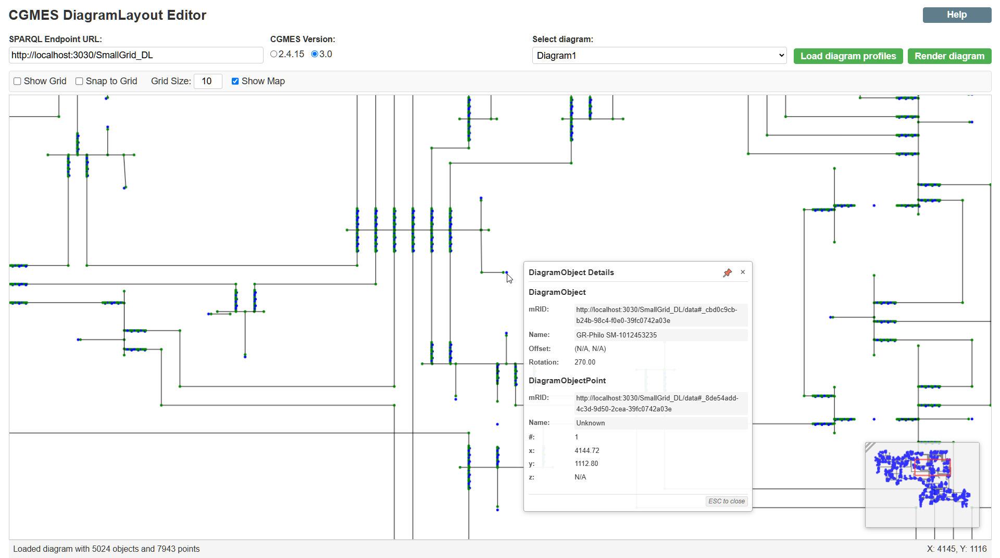
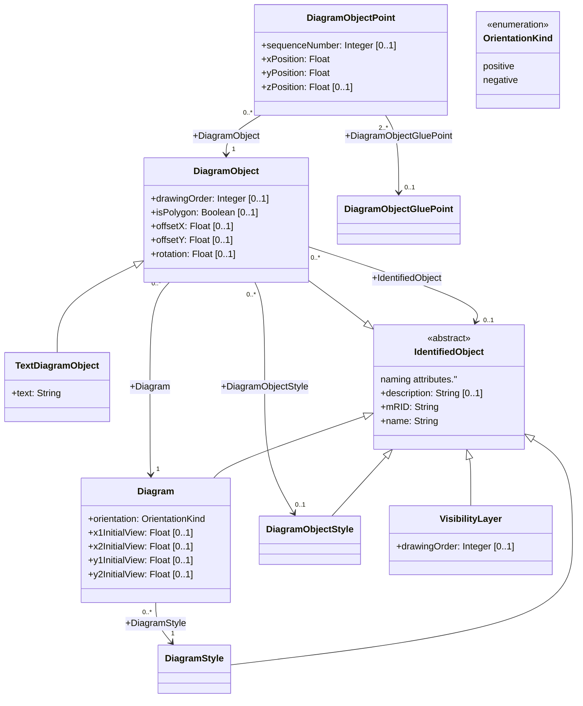

# CGMES DiagramLayout Editor

A web application for editing CGMES (Common Grid Model Exchange Standard) Diagram Layout profiles (IEC 61970-453). 
This tool allows power system engineers and grid operators to visualize and modify network diagrams through an interactive web interface.



## Disclaimer

This project was developed as an internal proof-of-concept and should not be used in production environments.

The goal was to explore and understand the best ways to interact with and edit "Diagram Layout Profile" data. Among other objectives, this included determining optimal implementations for mouse and keyboard controls.

The project also serves as a demonstrator for several key features, including the selection, rotation, and mirroring of elements from the Diagram Layout Profile.

The application was largely generated using artificial intelligence, primarily utilizing Anthropic Claude 3.7 Sonnet.

## Features

- **SPARQL Integration**: View and edit diagram layouts directly from SPARQL endpoints
- **Interactive Canvas**: Pan, zoom, select, and drag diagram elements
- **CGMES Support**: Compatible with CGMES versions 2.4.15 and 3.0
- **Real-time Updates**: Direct modification of point positions via SPARQL updates
- **Advanced Editing**: Add/delete points, create/modify polygons, copy/paste objects
- **Navigation Map**: Mini-map in corner for navigating large diagrams
- **Responsive Design**: Adapts to different screen sizes and devices

### Transformation Operations

#### Point-Based Transformations

The CGMES DiagramLayout Editor uses point-based transformation operations for rotation and mirroring. This means:

- **Direct Point Control**: Rotations and mirroring operations work directly on the selected points
- **Granular Control**: You can transform partial objects by selecting only some of their points
- **No Automatic Expansion**: Selecting a point doesn't automatically select all points of its parent object

#### Working with Transformations

1. **Select Points**: Use Ctrl+Click or Ctrl+Drag to select the points you want to transform
2. **Transform**: Click the rotation (+90°/-90°) or mirroring (↔/↕) buttons
3. **Whole Objects**: To transform entire objects, first select all their points using:
  - Ctrl+Drag to create a selection rectangle
  - Ctrl+C to copy objects (which selects all their points)

### Navigation Map

The editor features a navigation map in the lower right corner that:

- Shows a miniature view of the entire diagram
- Highlights the currently visible portion of the diagram
- Allows quick navigation by clicking or dragging within the map
- Helps maintain context when working with large diagrams

### Glue Point Support

#### DiagramObjectGluePoint

The CGMES DiagramLayout profile includes a class called `DiagramObjectGluePoint` that is used for grouping diagram object points from different diagram objects. These points are considered to be logically glued together in a diagram even if they are not at the exact same coordinates.

#### Working with Glue Points

- **Creating Glue Points**: Select two or more points from different diagram objects and check the "glued" checkbox that appears at the center of the selection.
- **Visualizing Glue Points**: Toggle the "Show Glue Connections" checkbox to display lime green markers at the center of each glue point.
- **Selecting Glue Points**: Click on a lime green glue point marker to select it and view all its connections.
- **Managing Connection Points**:
    - **Removing Points**: When a glue point is selected, each connected point shows a red "×" button. Click this button to remove the point from the glue point.
    - **Adding Points**: When a glue point is selected, compatible points (from different diagram objects not yet in the glue point) show a green "+" button. Click this button to add the point to the glue point.
- **Deleting Glue Points**: Select a glue point and press the DELETE key to remove it entirely.

#### Glue Point Rules and Behavior

- **Different Objects Requirement**: A glue point must connect points from at least two different diagram objects.
- **Visual Representation**: Glue points are represented by a lime green marker at the center of the connected points.
- **Connection Display**: When a glue point is selected or hovered, dotted lines show connections to all its points.
- **Automatic Cleanup**: If removing a point would make a glue point invalid (fewer than 2 points or all from the same object), the entire glue point is removed.
- **Independent Movement**: Points that are glued together maintain their logical connection while allowing independent movement.


## Diagram Layout Profile

CGMES defines a diagram layout profile that represents the layout of a diagram in a power system model. The profile includes the following classes:



## How It Works

The application connects to a SPARQL endpoint containing CGMES diagram data and allows users to:

1. **Load and visualize diagrams**: Queries the SPARQL endpoint for available diagrams and renders them in an interactive canvas
2. **Modify diagram elements**: Edit point positions, add or remove points, and update object properties
3. **Navigate large diagrams**: Use the navigation map to quickly move around and identify your current position
4. **Persist changes**: Write modifications back to the SPARQL endpoint in real-time

### Technical Architecture

The editor follows a clean architecture with clear separation of concerns:

- **Core**: Core models, types, and configuration
- **Features**: Feature-based modules (canvas, diagram, interaction, etc.)
- **Services**: Handle SPARQL communication and application services
- **Queries**: SPARQL query builders for different operations
- **Utils**: Utility functions for geometry, canvas operations, etc.

### SPARQL Implementation

The application uses SPARQL to:
- Query diagram profiles and layouts from the endpoint
- Update point positions and object properties
- Insert new points or delete existing ones
- Clone objects for copy/paste operations

All SPARQL queries and updates are crafted to conform to the CGMES standard, ensuring compatibility with various power system data repositories.

## Development

### Prerequisites

- Node.js (v16+)
- npm or yarn

### Installation

```bash
# Clone the repository
git clone https://github.com/yourusername/cgmes-editor-svelte.git
cd cgmes-editor-svelte

# Install dependencies
npm install
# or
yarn install
```

### Development Server

```bash
npm run dev
# or
yarn dev
```

The development server will:
1. Build the user documentation from AsciiDoc to HTML
2. Start the Vite development server
3. Make the application available at http://localhost:3000

### Building Documentation

The application uses AsciiDoc for documentation, which is converted to HTML at build time:

```bash
npm run build:docs
# or
yarn build:docs
```

This command processes the AsciiDoc files in the `docs/` directory and generates HTML files in the `public/docs/` directory for use in the application.

### Building for Production

```bash
npm run build
# or
yarn build
```

This will build the documentation and create a production-ready application in the `dist` directory.

## User Guide

For detailed instructions on how to use the application, including keyboard shortcuts and mouse interactions, please refer to the [User Guide](docs/user-guide.adoc) documentation.

## Project Structure

```
cgmes-editor-svelte/
├── docs/                     # Documentation source files
│   └── user-guide.adoc       # User guide in AsciiDoc format
├── public/                   # Static files
│   └── docs/                 # Generated documentation
│       ├── user-guide.html   # Generated HTML documentation
├── scripts/                  # Build scripts
│   └── build-docs.js         # Script to convert AsciiDoc to HTML
├── src/                      # Source code
│   ├── core/                 # Core models and configuration
│   │   ├── config/           # Application configuration
│   │   └── models/           # Core data models
│   ├── features/             # Feature modules
│   │   ├── canvas/           # Canvas rendering and state
│   │   ├── diagram/          # Diagram loading and state
│   │   ├── gluepoints/       # Glue point functionality
│   │   ├── help/             # Help documentation component
│   │   ├── interaction/      # User interaction handling
│   │   ├── navigation/       # Navigation map component
│   │   ├── objects/          # Diagram object operations
│   │   ├── points/           # Point operations 
│   │   ├── tooltips/         # Tooltip functionality
│   │   └── ui/               # UI components and state
│   ├── queries/              # SPARQL query builders
│   ├── services/             # Application services
│   │   └── utils/            # Service utilities
│   ├── styles/               # CSS styles
│   └── utils/                # Utility functions
└── tests/                    # Tests
```

## Testing

As a proof-of-concept, this project currently includes no automated tests. 

If there were some, they would run using:

```bash
npm run test
# or
yarn test
```

## Contributing

We welcome contributions to improve the CGMES DiagramLayout Editor! Please see our [Contributing Guide](CONTRIBUTING.md) for details on how to submit pull requests, report issues, and suggest improvements.

## Code of Conduct

This project adheres to a code of conduct adapted from the [Apache Foundation's Code of Conduct](https://www.apache.org/foundation/policies/conduct). We expect all contributors and users to follow these guidelines to ensure a welcoming and inclusive community.

## License

[Apache-2.0 license](LICENSE)